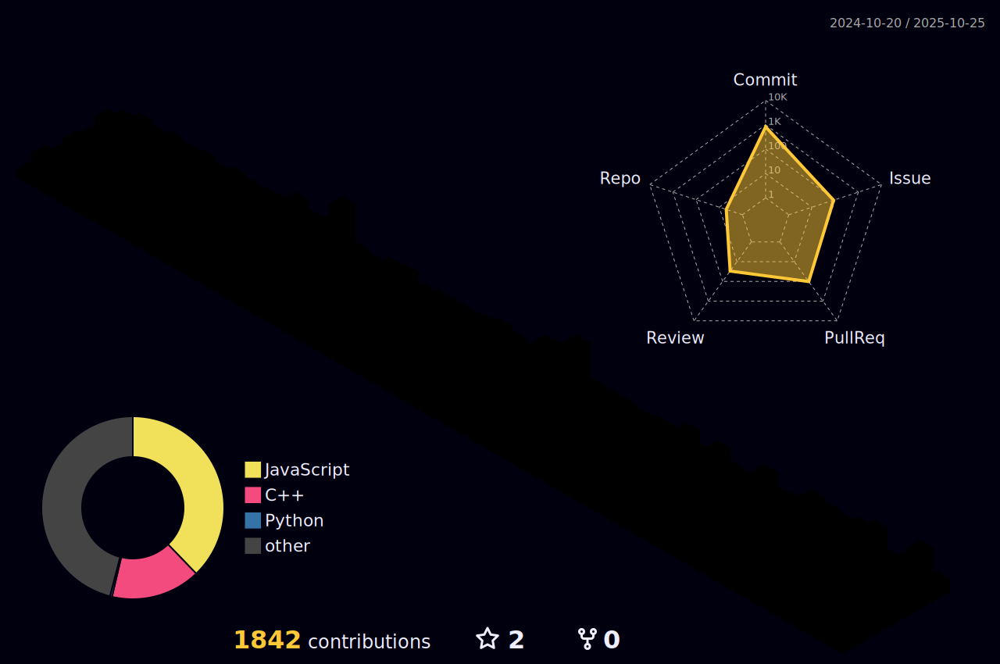

<!--
**ArcueidShiki/ArcueidShiki** is a ✨ _special_ ✨ repository because its `README.md` (this file) appears on your GitHub profile.

Here are some ideas to get you started:

- 🔭 I’m currently working on ...
- 🌱 I’m currently learning ...
- 👯 I’m looking to collaborate on ...
- 🤔 I’m looking for help with ...
- 💬 Ask me about ...
- 📫 How to reach me: ...
- 😄 Pronouns: ...
- ⚡ Fun fact: ...
https://github.com/tandpfun/skill-icons?tab=readme-ov-file#icons-list
-->

[](https://git.io/typing-svg)


---
<picture>
  <source media="(prefers-color-scheme: dark)" srcset="https://github.com/ArcueidShiki/ArcueidShiki/blob/output/github-contribution-grid-snake-dark.svg">
  <source media="(prefers-color-scheme: light)" srcset="https://github.com/ArcueidShiki/ArcueidShiki/blob/output/github-contribution-grid-snake.svg">
  
</picture>



<!--START_SECTION:waka-->

```txt
C++        10 hrs 51 mins  █████████████████████▓░░░   87.08 %
Markdown   1 hr 30 mins    ███░░░░░░░░░░░░░░░░░░░░░░   12.10 %
Other      2 mins          ░░░░░░░░░░░░░░░░░░░░░░░░░   00.34 %
C          2 mins          ░░░░░░░░░░░░░░░░░░░░░░░░░   00.30 %
Makefile   1 min           ░░░░░░░░░░░░░░░░░░░░░░░░░   00.17 %
```

<!--END_SECTION:waka-->

## 🛠️ My Skill Set

### Languages

                


### Frontend

       

### Backend


      


### Tools


### Learning


### Video Production


## 📈 GitHub Stats

<!---->

<h6 align="center">

  

</h6>

## Profile Views
Counting of visitors to this page in this section started on Oct 23, 2024
<br>


<a href="https://info.flagcounter.com/qmQl"></a>

## 🌟 Projects

- **[Penni](https://github.com/codersforcauses/penni)** - A platform for retirees to find part-time jobs. Built with Next.js, React, TypeScript, Tailwind CSS, Django, and PostgreSQL.
- **[Hiperf](https://gitee.com/openharmony/developtools_hiperf)** - hiperf is a command-line debugging tool provided by OpenHarmony for developers. It can capture performance data of a specific program or the entire system, like the kernel's perf tool. hiperf can run on Windows, Linux, and macOS.

- **[Faultlog](https://gitee.com/openharmony/hiviewdfx_faultloggerd)** - Faultloggerd is a component that generates and manages temporary C/C++ runtime crash logs in OpenHarmony. You can find crash logs in the preset directory to locate faults.


## 🔗 Connect with me

- [LinkedIn](https://www.linkedin.com/in/jingtong-peng-3068672b6/)
- [GitHub](https://github.com/ArcueidShiki)
